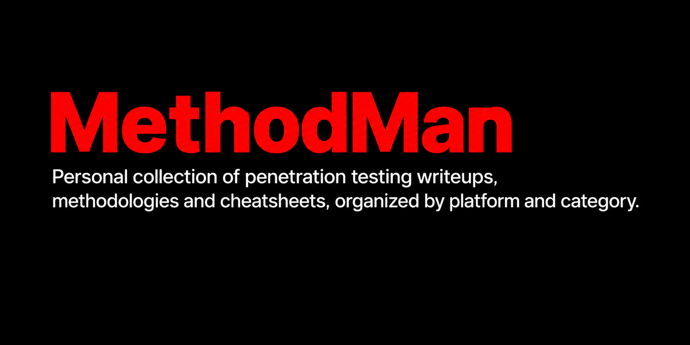

# MethodMan

[](https://github.com/N3xu666/MethodMan/actions/workflows/validate.yml)
[](https://github.com/N3xu666/MethodMan/commits/main)
[](https://github.com/N3xu666/MethodMan)
[](https://creativecommons.org/licenses/by-nc/4.0/)



New machines and platforms will be added as they are completed,  
while methodologies and cheatsheets are updated regularly.

Writeups available in Az/En/Ru. Currently: **14 published (retired) + 3 active stubs** = **17 completed machines**.

> The `(Now: M machines)` counter counts **only published walkthroughs** (machines retired on Hack The Box). Writeups for active machines are withheld per HTB ToS and stored as stubs (`Status: Completed`) until retirement.

> [!NOTE]
> All flags, passwords, hashes, and session tokens have been masked for ethical reasons.

---

## Structure

```
MethodMan/
+-- 01 HTB/
|   +-- 01 All Machines/
|   |   +-- 01 Season 12 (Aero, Sep - Nov 2026)/
|   |       +-- 01 Az/   # Azerbaijani writeups
|   |       +-- 02 En/   # English writeups
|   |       +-- 03 Ru/   # Russian writeups
|   +-- 02 OSCP/
|       +-- 01 Linux/
|       |   +-- 01 Az/
|       |   +-- 02 En/
|       |   +-- 03 Ru/
|       +-- 02 Windows/
|       +-- 03 Active Directory and Networks/
```

---

## Contents

| Section | Description | Az | En | Ru |
|---------|-------------|-----|-----|-----|
| [HTB / Season 12 Aero](./01%20HTB/01%20All%20Machines/01%20Season%2012%20%28Aero%2C%20Sep%20-%20Nov%202026%29/) | Special HTB season, Sep - Nov 2026 | [Az](./01%20HTB/01%20All%20Machines/01%20Season%2012%20%28Aero%2C%20Sep%20-%20Nov%202026%29/01%20Az/) | [En](./01%20HTB/01%20All%20Machines/01%20Season%2012%20%28Aero%2C%20Sep%20-%20Nov%202026%29/02%20En/) | [Ru](./01%20HTB/01%20All%20Machines/01%20Season%2012%20%28Aero%2C%20Sep%20-%20Nov%202026%29/03%20Ru/) |
| [HTB / OSCP / Linux](./01%20HTB/02%20OSCP/01%20Linux/) | Linux machines for OSCP prep | [Az](./01%20HTB/02%20OSCP/01%20Linux/01%20Az/) | [En](./01%20HTB/02%20OSCP/01%20Linux/02%20En/) | [Ru](./01%20HTB/02%20OSCP/01%20Linux/03%20Ru/) |
| [HTB / OSCP / Windows](./01%20HTB/02%20OSCP/02%20Windows/) | Windows machines for OSCP prep | - | - | - |
| [HTB / OSCP / Active Directory and Networks](./01%20HTB/02%20OSCP/03%20Active%20Directory%20and%20Networks/) | AD and networks | - | - | - |

**Note:** files marked with `Status: Completed` are **stubs** for machines still active on HTB. Full writeups are published after retirement.

---

## Quality & Automation

Every commit is validated by a two-layer system:

- **`check.ps1`** - fast pre-commit hook (8 checks: real flags, dict leaks, ethical note, dashes, broken chars, masking artifacts, heuristic password detection, CVE reference). Runs in ~2 seconds.
- **`audit.ps1`** - full local repository audit (git state, tracked files, walkthrough structure, Attack Chain, note placement, flags, dict leaks, dashes, encoding, placeholders, documentation, scripts, hook, origin sync, dynamic machine count, language-pair verification). Runs in ~5 seconds.

CI runs `check.ps1` and `tests/run-tests.ps1` on every push (`.github/workflows/validate.yml`, Windows runner, pinned actions). `audit.ps1` is local-only (`-SkipLocalChecks` for repo-only mode).

The masking pipeline (`mask.ps1` + a local-only `masking-dict.ps1` with known sensitive values) detects and masks flags (32-hex pattern), values listed in the dictionary, and heuristic password shapes. Detection is dictionary- and pattern-based, not exhaustive - manual review remains part of the workflow.

---

## Conventions

- **`01 Az/`** - Azerbaijani writeups.
- **`02 En/`** - English writeups.
- **`03 Ru/`** - Russian writeups.
- Each writeup follows a unified structure: Attack Chain -> Machine Briefing -> Recon -> Foothold -> Lateral Movement -> Privilege Escalation -> Flags -> Key Takeaways.
- All sensitive data (flags, passwords, hashes) is masked.

---

## License

This work is licensed under the Creative Commons Attribution-NonCommercial 4.0 International License.
See [LICENSE](./LICENSE) for details.

---

*Personal project. For educational purposes only.*
